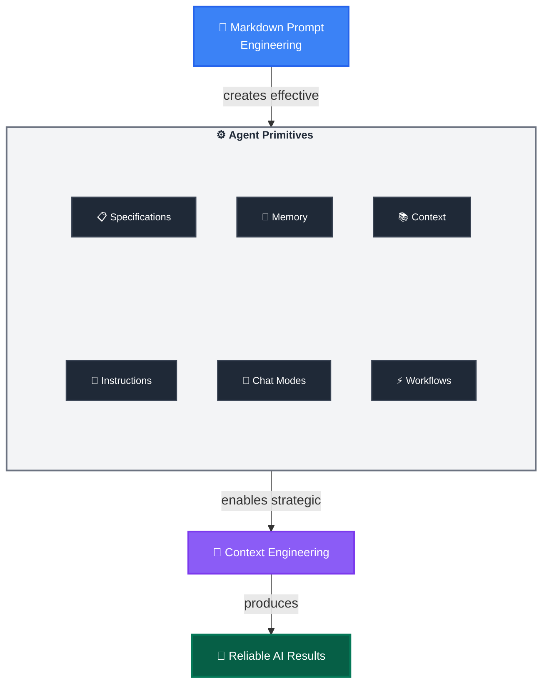

多數開發者在開始使用 AI 時，都是先在 GitHub Copilot 裡丟一些簡單的 prompt 試試看，然後「希望」能有好結果。這種方式在處理簡單任務時還算堪用，但一旦你需要的是「可靠、可重複的複雜開發工作」，它就會開始失靈。

下面這個三層框架，就是為了把這種臨時性、實驗性的使用方式，轉變為系統化的工程實踐。

## Layer 1：Markdown Prompt Engineering

**基礎層：** 使用 Markdown 的語義結構，把自然語言轉換成具備結構且可重複使用的指令。

**為什麼有效：** Markdown 的結構（標題、列表、連結）會自然引導 AI 的推理路徑，讓輸出更可預測、也更一致。

### 關鍵技巧

- **Context Loading（上下文載入）**：`[Review existing patterns](./src/patterns/)`——連結可以視為「上下文注入點」，引導 AI 從檔案或網站載入相關資訊
- **Structured Thinking（結構化思考）**：標題與項目符號，有助於為 AI 建立清楚的推理階層
- **Role Activation（角色啟動）**：`You are an expert [role]`——啟動特定領域的專家角色，聚焦回應
- **Tool Integration（工具整合）**：`Use MCP tool tool-name`——把 prompt 清楚連接到 MCP server 的確定性程式碼執行
- **Precision Language（精確語言）**：用具體、不含糊的語句來降低歧義
- **Validation Gates（驗證關卡）**：`Stop and get user approval`——在關鍵決策點插入人類審核

### 快速獲利範例

不要寫：`Find and fix the bug`，可以改成：

```markdown
You are an expert debugger, specialized in debugging complex programming issues. 

You are particularly great at debugging this project, which architecture and quirks can be consulted in the [architecture document](./docs/architecture.md). 

Follow these steps:

1. Review the [error logs](./logs/error.log) and identify the root cause. 

2. Use the `azmcp-monitor-log-query` MCP tool to retrieve infrastructure logs from Azure.  

3. Once you find the root cause, think about 3 potential solutions with trade-offs

4. Present your root cause analysis and suggested solutions with trade-offs to the user and seek validation before proceeding with fixes - do not change any files.
```

當你熟悉了這種結構化 prompting 的方式，很快就會發現：「每個任務都用手寫完美 prompt」根本撐不久。這時候就會需要第二層——把這些 prompt engineering 的技巧變成可重用、可配置的系統。

## Layer 2：Agent Primitives  

**實作層：** 將你的 prompt engineering 技巧「系統化部署」出去的可配置工具集合。

### 核心 Primitives

- **Instructions Files**：透過模組化 `.instructions.md` 檔案，在明確的 scope 內提供結構化指導
- **Chat Modes**：透過 `.chatmode.md` 檔案定義角色與 MCP 工具邊界，以角色為中心部署專業知識並防止跨域安全問題——就像專業執照，讓 architects 不會直接施工，也不讓 engineers 擅自訂策略
- **Agentic Workflows**：使用具備內建驗證關卡的 `.prompt.md` 檔案，部署可重複使用的工作流程 prompts
- **Specification Files**：透過 `.spec.md` 檔案建立「實作就緒」的藍圖，讓人與 AI 在同一份規格下走出確定性的結果
- **Agent Memory Files**：用 `.memory.md` 檔案在不同 session 之間保存專案知識
- **Context Helper Files**：以 `.context.md` 檔案最佳化資訊檢索與 context loading

### 轉換效果

Agent Primitives 是 AI Native Developer 不斷迭代調整的核心可配置元件，它們把原本零散的 prompt 技巧，轉化為可維護、可版本化、可組合的資產，讓你透過系統化的 prompt engineering 來取得更可靠的結果。

**範例轉換：**

- **技術層面：**「實作安全的使用者認證系統」（屬於 Markdown Prompt Engineering）
- **Primitives 流程：**
  - 開發者選擇 `backend-dev` chat mode  
  - 透過 `applyTo: "auth/**"` 自動啟用 `security.instructions.md`  
  - 從 `[Previous auth patterns](.memory.md#security)` 與 `[API Security Standards](api-security.context.md#rest)` 載入既有上下文  
  - 使用結構化模板產生 `user-auth.spec.md`  
  - 執行帶有驗證關卡的 `implement-from-spec.prompt.md` workflow
- **結果：** 實作過程中的失敗會被記錄在 `.memory.md` 中，成功的解法會逐漸整合到 `.instructions.md`，而 `.prompt.md` workflows 則持續優化——整體形成一個由你驅動的「複合智慧」系統（這也是後面 Context Engineering 要處理的部分）。

這樣的轉換乍看之下有點複雜，但模式很清楚：

- 原本一次性的請求 → 變成具有明確交接點的系統化 workflow  
- 上下文載入 → 從 ad-hoc 變成自動、可預期的行為  
- 驗證 → 變成 workflow 裡的設計元素，而不只是事後補救  

每一個 primitive 檔案，都是會隨著時間與使用次數而「長大」的知識資產，服務的不只是你自己，而是整個團隊。

> 💡 **VS Code 原生支援 & 擴展：** VS Code 原生支援 `.instructions.md`、`.prompt.md` 與 `.chatmode.md`。在這個框架裡，我們再向前擴展 `.spec.md`、`.memory.md` 與 `.context.md` 等 pattern，代表 AI Native Development 的前沿實踐。

當 prompts 結構化，primitives 架好之後，你會遇到下一個問題：再好的 prompts 與 primitives，如果被大量無關 context 淹沒，或在有限 context window 中彼此競爭注意力，效果一樣會變差。這就是第三層要處理的事——透過策略性 context 管理來穩定 Agent 的效能。

## Layer 3：Context Engineering

**策略框架：** 在有限 context window 的限制下，系統化管理 LLM 的「注意力空間」，讓 agents 在實務場景中維持穩定表現。

### 為什麼上下文這麼關鍵

LLM 有有限的注意力範圍（context window），記憶效果也不是完美持久。好的 context 管理，既能幫助 agents 專注於真正重要的資訊，也能讓它們「啟動得更快」，不必花太多 token 讀取不相干或容易誤導的內容，進而：

- 保留更多 context 空間給核心程式碼與邏輯
- 降低混亂訊號，提升可靠度與一致性

### 通用「可發現性」挑戰

目前生態系中，針對 context 格式有很多分裂的嘗試——`.instructions.md`（VS Code）、`.cursorrules`（Cursor）、`.clinerules`（Cline）、`CLAUDE.md`（Claude Desktop）等——這會把團隊鎖進單一工具供應商的生態。

**[AGENTS.md 標準](https://agents.md)** 就是在這樣的背景下出現的通用解法，目前已被超過 20,000 個開源專案採用。

**範例結構：**

```
project/
├── AGENTS.md                    # Root：專案層級原則
├── frontend/
│   ├── AGENTS.md               # 前端專用 context
│   └── Button.tsx              # 繼承 root + frontend
└── backend/
    ├── AGENTS.md               # 後端專用 context
    └── auth.ts                 # 繼承 root + backend
```

Agents 會沿著目錄樹向上尋找最近的 `AGENTS.md` 檔案，載入對應的上下文。這意味著：

- 前端檔案只會讀到 frontend + root 的 context  
- 後端檔案只會讀到 backend + root 的 context  

這種層級式的 context 探索機制，就是能在大專案裡維持可擴展性的關鍵做法。

### 關鍵技術

- **Session Splitting（會話分割）**：針對不同階段（規劃 → 實作 → 測試）使用不同 Agent sessions。每個 session 都有「乾淨的 context」，讓注意力更集中。
- **Modular Rule Loading（模組化規則載入）**：使用 `.instructions.md` + `applyTo` pattern 來精準控制哪些規則套用到哪些檔案，並透過編譯成 `AGENTS.md` 來達到跨工具可攜。
- **Hierarchical Discovery（階層式探索）**：利用目錄階層與 `AGENTS.md` 的位置關係，將不同領域的規則限制在專屬範圍內。
- **Memory-Driven Development（記憶驅動開發）**：透過 `.memory.md` 檔案累積專案知識、決策紀錄與常見錯誤，讓 agents 在之後的 session 中可以直接引用。
- **Context Optimization（上下文最佳化）**：用 `.context.md` 幫助 AI 快速鎖定關鍵文件與範例，避免每次都 full-text search 全專案。
- **Cognitive Focus Optimization（認知焦點優化）**：透過 `.chatmode.md` 把模型的「任務範圍」鎖進某個 domain（例如 backend、frontend），避免一次性塞入太多不相關的問題。

### 實務好處

- 複雜任務可以透過 session splitting 拆成多個專注階段
- 指令透過 `.instructions.md` + Compilation 變成單一真相來源，再自動產生適合不同目錄的 `AGENTS.md`
- Context 污染被壓到最低——agents 只會載入與當前檔案相關的規則與背景
- `.memory.md` 讓專案知識得以長期累積，降低「重新踩雷」的頻率
- `.context.md` 讓 AI 可以更快找到正確文件，減少 token 浪費
- 有了通用的 `AGENTS.md` 格式，同一組 context 可以在 GitHub Copilot、Cursor、Codex、Aider 等工具間共享

**透過 Primitives 實踐：** 這些 context engineering 技巧，都是透過前面提到的 primitives 具體落地實作，形成一個相互強化的系統。

## Agentic Workflows：完整系統上線運作

現在你已經理解三個層級各自扮演的角色，我們可以看看它們如何合在一起，變成 **Agentic Workflows**——也就是會把所有 primitives 串連起來，形成端到端解決方案的完整流程。

**Agentic Workflows** 通常實作成 `.prompt.md` 檔案，負責協調與編排所有 primitives。不論你是在本地 IDE 裡執行，或是委派給 async agents，這些 workflows 都能保持一致行為。

### 關鍵特性

- **完整編排（Full Orchestration）**：把三層（Markdown Prompt Engineering + Agent Primitives + Context Engineering）整合成一條 workflow
- **完整自動化（Complete Automation）**：從載入 context，到實作，再到學習整合，整個流程都被設計在 prompt 內
- **執行彈性（Execution Flexibility）**：同一個 workflow 既可本地執行，也可交給 GitHub Coding Agents
- **自我提升（Self-Improving Intelligence）**：透過更新 `.memory.md`、`.instructions.md`、`.spec.md` 等檔案，使 workflow 會越跑越好

**整合威力：** 原本看似分散的技巧與 primitives，透過 Agentic Workflows 變成有系統的「完整流程」，可以承接整個開發任務，並在每次執行時吸收新的學習，進而反饋到 primitives 本身，形成正向循環。

## AI Native Development 框架

<div class="diagram-container" markdown="1">



</div>

**Markdown Prompt Engineering + Agent Primitives + Context Engineering = Reliability**

## 重點總結

1. **Markdown Prompt Engineering** 提供可預測 AI 互動的基本結構
2. **Agent Primitives** 把這些技巧變成可擴展、可管理的配置工具  
4. **Context Engineering** 負責在有限記憶下，最大化 AI 的「認知表現」
3. **Agentic Workflows** 則把上述三層整合，打造能執行完整任務的可靠流程
5. **整體框架** 會隨著每次迭代與學習持續改善，形成可服務整個團隊與組織的複合智慧

**準備好實作了嗎？** 下一步前往 [快速開始](../getting-started/)，在實際專案中建立你的第一批 Agent Primitives 與階層式結構。

**想先了解工具生態？** 可以先閱讀 [工具生態](../tooling/)，認識 Agent CLI Runtimes、context compilation 與套件管理。

**想直接看完整 workflow 的執行策略？** 可以跳到 [Agent 委派](../agent-delegation/)，了解本地與非同步協作的運作模式。
